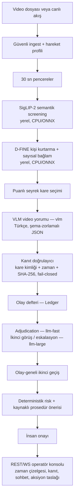

# Dörtgöz — Mimari Özet

Bu belge sistemin güncel üretim mimarisini özetler. Bileşen bazlı karar
gerekçeleri ve literatür dayanakları için
[`DORTGOZ_ARCHITECTURE_BASELINE.md`](../DORTGOZ_ARCHITECTURE_BASELINE.md),
ölçümler için [`BENCHMARK_REPORT.md`](BENCHMARK_REPORT.md) kullanılır.

## Uçtan uca akış

Algı katmanı (screening, D-FINE, kare seçimi) tamamen yereldir ve CPU/ONNX ile
çalışır. Dil/görü çıkarımı, yarışmanın sağladığı EVREN servisinde (vLLM, BF16)
veya `.env` ile seçilen herhangi bir OpenAI-uyumlu uçta çalışır. Bulut API ve
ücretli servis kullanılmaz.

## Model rolleri

| Takma ad | Rol |
|---|---|
| `vlm` | Pencere video yorumu; Türkçe olay betimleme, şema-zorlamalı JSON |
| `llm-fast` | Olay adjudication ve operatör sohbet ajanı |
| `llm-large` | İkinci görüş, eskalasyon ve olay-geneli denetim |
| `router` | Sohbet niyet yönlendirme |
| `guard` | Girdi/çıktı güvenlik denetimi |
| `bge-m3-embed` | Prosedür RAG gömlemeleri (Qdrant) |

Takma adlar `backend/dortgoz/config.py` içinde `DORTGOZ_*` ortam
değişkenleriyle değiştirilebilir.

## Ajan bileşenleri

- **Ajan döngüsü:** LangGraph üzerinde ReAct araç döngüsü. Operatör, canlı
  Ledger bağlamında arama, vurgulama, yeniden inceleme ve aksiyon taslağı
  araçlarını sohbetle kullanır.
- **Bellek:** Ledger, pencere raporlarını olay sürekliliğinde birleştirir
  (fail-closed geçici kabul, sessizlik toleransı, yapışkan `needs_review`).
  Koşu kaydı JSONL olarak tutulur.
- **Araç güvenliği:** Kritik ve silah benzeri olaylar insan incelemesine gider.
  Dış aksiyonlar kanıt kapısından ve insan onayından sonra yalnız yerel taslak
  üretir; `external_side_effect=false` sözleşmesi korunur.
- **Hata işleme:** Şema, zaman ve kanıt doğrulaması zorunludur; geçersiz kanıt
  olay durumunu değiştiremez. Model erişilemezse sistem typed
  `MODEL_UNAVAILABLE` ile güvenli tarafta kalır.

## Çıktı sözleşmesi

Backend ile frontend arasındaki tek sözleşme WS olay şemasıdır:
`backend/dortgoz/events.py` ↔ `frontend/src/types/events.ts` birbirinin
aynasıdır ve `backend/tests/test_smoke.py` bu eşleşmeyi korur. Model çıktıları
JSON Schema ile kısıtlanır ve Pydantic ile doğrulanır. Olaylar zaman damgası,
sınıf, şiddet, kanıt ve risk gerekçesiyle yapılandırılmış biçimde taşınır.

## Çalışma kipleri

| Kip | Ne yapar |
|---|---|
| `DORTGOZ_MOCK=1` (varsayılan dev) | Yalnız arayüz olay sözleşmesini oynatır; model/GPU istemez |
| Gerçek kip (`dev.sh real`) | Gerçek video analizi; `.env` + preflight kontrolü zorunlu |

`scripts/preflight.py` geçmeden gerçek profil açılmaz. Varsayılan ağ bağlama
`127.0.0.1`'dir; uzak erişim yalnız açık bayrakla açılır.

## Bilinen sınırlar

Ölçülen zayıflıklar ve sınırlar dürüstçe raporlanır: kısa süreli olaylar ve
Shoplifting/Stealing sınıfı zayıftır, yanlış alarm çekirdeği `hirsizlik`
dalından gelir ve bastırılamaz (yakalama kaybı pahasına). Ayrıntı:
[`BENCHMARK_REPORT.md`](BENCHMARK_REPORT.md) bölüm 10 ve
[`DORTGOZ_ARCHITECTURE_BASELINE.md`](../DORTGOZ_ARCHITECTURE_BASELINE.md)
bölüm 5.
